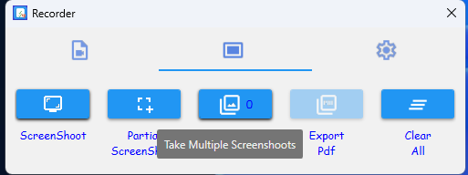
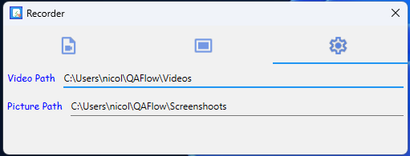

**Basic Setup**

Where is the fucking exe!
Well the executable is self contained with no BS or scattered dll in the program. 
The settings are bakked in the .exe which is the Video path and Picture path.

Basic Use:
There is a hotkey F1 that will show what each button does.

Video Capture 

 

What is the difference between this program and the Windows Screenshoot and video capture? Well it is the size, we are not limited to what we can save, we are limited to what is allowed on third party software. In this software it was applied compression. 

Screenshoot Capture 

 
Here We have the option to take full screen or a specific region.
Additional to this we have the option to take multiple screenshots.

When this is done we will know how many pictures were taken. and when we have more than one we can save all pictures in a single pdf by order.

If we want to clear the temporary folder we can do that by clicking the clear button.

Settings 

 

We have a default path for the video and picture. We can change that.

For transparency we save the logs of the app in "C:\Users\{user}\QAFlow\Logs".

Bydefault we have the following structure:
 
